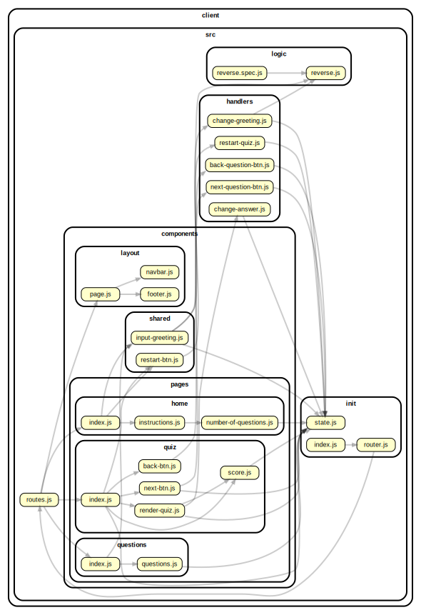

<<<<<<< HEAD

<!-- BEGIN TITLE -->

# DOCS

<!-- END TITLE -->

<!-- BEGIN TREE -->

> [interactive graph](./dependency-graph.html)

<!-- END TREE -->

<!-- BEGIN TOC -->

- components
  - layout
    - [footer.js](#clientsrccomponentslayoutfooterjs)
    - [navbar.js](#clientsrccomponentslayoutnavbarjs)
    - [page.js](#clientsrccomponentslayoutpagejs)
  - pages
    - home
      - [index.js](#clientsrccomponentspageshomeindexjs)
      - [instructions.js](#clientsrccomponentspageshomeinstructionsjs)
      - [number-of-questions.js](#clientsrccomponentspageshomenumber-of-questionsjs)
    - questions
      - [delete-button.js](#clientsrccomponentspagesquestionsdelete-buttonjs)
      - [index.js](#clientsrccomponentspagesquestionsindexjs)
      - [questions.js](#clientsrccomponentspagesquestionsquestionsjs)
    - quiz
      - [back-btn.js](#clientsrccomponentspagesquizback-btnjs)
      - [index.js](#clientsrccomponentspagesquizindexjs)
      - [next-btn.js](#clientsrccomponentspagesquiznext-btnjs)
      - [render-quiz.js](#clientsrccomponentspagesquizrender-quizjs)
      - [score.js](#clientsrccomponentspagesquizscorejs)
  - shared
    - [input-greeting.js](#clientsrccomponentssharedinput-greetingjs)
    - [restart-btn.js](#clientsrccomponentssharedrestart-btnjs)
- handlers
  - [back-question-btn.js](#clientsrchandlersback-question-btnjs)
  - [change-answer.js](#clientsrchandlerschange-answerjs)
  - [change-greeting.js](#clientsrchandlerschange-greetingjs)
  - [delete-question.js](#clientsrchandlersdelete-questionjs)
  - [next-question-btn.js](#clientsrchandlersnext-question-btnjs)
  - [restart-quiz.js](#clientsrchandlersrestart-quizjs)
- init
  - [index.js](#clientsrcinitindexjs)
  - [router.js](#clientsrcinitrouterjs)
  - [state.js](#clientsrcinitstatejs)
- logic
  - [reverse.js](#clientsrclogicreversejs)
- [routes.js](#clientsrcroutesjs)

---

<!-- END TOC -->

<!-- BEGIN DOCS -->

# /components

## /layout

<a href="../../client/src/components/layout/footer.js" id="clientsrccomponentslayoutfooterjs">../client/src/components/layout/footer.js</a>

## footer ⇒ <code>HTMLDivElement</code>

The shared footer.

**Returns**: <code>HTMLDivElement</code> - A rendered footer element.

<a href="../../client/src/components/layout/navbar.js" id="clientsrccomponentslayoutnavbarjs">../client/src/components/layout/navbar.js</a>

## navbar ⇒ <code>HTMLDivElement</code>

The shared navbar.

**Returns**: <code>HTMLDivElement</code> - A rendered nav bar element.

| Param  | Type                | Description                          |
| ------ | ------------------- | ------------------------------------ |
| routes | <code>object</code> | A routes object, see /src/routes.js. |

<a href="../../client/src/components/layout/page.js" id="clientsrccomponentslayoutpagejs">../client/src/components/layout/page.js</a>

## page ⇒ <code>HTMLDivElement</code>

The page layout component.

**Returns**: <code>HTMLDivElement</code> - A rendered page element.  
**Throws**:

- <code>TypeError</code> When the bodyComponent is not a function or DOM element.

| Param         | Type                                              | Description                               |
| ------------- | ------------------------------------------------- | ----------------------------------------- |
| bodyComponent | <code>function</code> \| <code>HTMLElement</code> | The body for the newly rendered page.     |
| routes        | <code>object</code>                               | The application's routes, for the navbar. |

---

## /pages

### /home

<a href="../../client/src/components/pages/home/index.js" id="clientsrccomponentspageshomeindexjs">../client/src/components/pages/home/index.js</a>

## home ⇒ <code>HTMLDivElement</code>

The home page.

**Returns**: <code>HTMLDivElement</code> - A rendered home page.

<a href="../../client/src/components/pages/home/instructions.js" id="clientsrccomponentspageshomeinstructionsjs">../client/src/components/pages/home/instructions.js</a>

<a href="../../client/src/components/pages/home/number-of-questions.js" id="clientsrccomponentspageshomenumber-of-questionsjs">../client/src/components/pages/home/number-of-questions.js</a>

---

### /questions

<a href="../../client/src/components/pages/questions/delete-button.js" id="clientsrccomponentspagesquestionsdelete-buttonjs">../client/src/components/pages/questions/delete-button.js</a>

<a href="../../client/src/components/pages/questions/index.js" id="clientsrccomponentspagesquestionsindexjs">../client/src/components/pages/questions/index.js</a>

## questions ⇒ <code>HTMLDivElement</code>

The questions page.

**Returns**: <code>HTMLDivElement</code> - A rendered questions page.

<a href="../../client/src/components/pages/questions/questions.js" id="clientsrccomponentspagesquestionsquestionsjs">../client/src/components/pages/questions/questions.js</a>

---

### /quiz

<a href="../../client/src/components/pages/quiz/back-btn.js" id="clientsrccomponentspagesquizback-btnjs">../client/src/components/pages/quiz/back-btn.js</a>

<a href="../../client/src/components/pages/quiz/index.js" id="clientsrccomponentspagesquizindexjs">../client/src/components/pages/quiz/index.js</a>

## quiz ⇒ <code>HTMLDivElement</code>

The quiz page.

**Returns**: <code>HTMLDivElement</code> - A rendered quiz page.

<a href="../../client/src/components/pages/quiz/next-btn.js" id="clientsrccomponentspagesquiznext-btnjs">../client/src/components/pages/quiz/next-btn.js</a>

<a href="../../client/src/components/pages/quiz/render-quiz.js" id="clientsrccomponentspagesquizrender-quizjs">../client/src/components/pages/quiz/render-quiz.js</a>

<a href="../../client/src/components/pages/quiz/score.js" id="clientsrccomponentspagesquizscorejs">../client/src/components/pages/quiz/score.js</a>

---

---

## /shared

<a href="../../client/src/components/shared/input-greeting.js" id="clientsrccomponentssharedinput-greetingjs">../client/src/components/shared/input-greeting.js</a>

<a href="../../client/src/components/shared/restart-btn.js" id="clientsrccomponentssharedrestart-btnjs">../client/src/components/shared/restart-btn.js</a>

---

---

# /handlers

<a href="../../client/src/handlers/back-question-btn.js" id="clientsrchandlersback-question-btnjs">../client/src/handlers/back-question-btn.js</a>

<a href="../../client/src/handlers/change-answer.js" id="clientsrchandlerschange-answerjs">../client/src/handlers/change-answer.js</a>

<a href="../../client/src/handlers/change-greeting.js" id="clientsrchandlerschange-greetingjs">../client/src/handlers/change-greeting.js</a>

<a href="../../client/src/handlers/delete-question.js" id="clientsrchandlersdelete-questionjs">../client/src/handlers/delete-question.js</a>

<a href="../../client/src/handlers/next-question-btn.js" id="clientsrchandlersnext-question-btnjs">../client/src/handlers/next-question-btn.js</a>

<a href="../../client/src/handlers/restart-quiz.js" id="clientsrchandlersrestart-quizjs">../client/src/handlers/restart-quiz.js</a>

---

# /init

<a href="../../client/src/init/index.js" id="clientsrcinitindexjs">../client/src/init/index.js</a>

<a href="../../client/src/init/router.js" id="clientsrcinitrouterjs">../client/src/init/router.js</a>

<a href="../../client/src/init/state.js" id="clientsrcinitstatejs">../client/src/init/state.js</a>

---

# /logic

<a href="../../client/src/logic/reverse.js" id="clientsrclogicreversejs">../client/src/logic/reverse.js</a>

## reverse ⇒ <code>string</code>

Reverses a string.

**Returns**: <code>string</code> - The reversed string.

| Param | Type                | Default                               | Description          |
| ----- | ------------------- | ------------------------------------- | -------------------- |
| [str] | <code>string</code> | <code>&quot;&#x27;&#x27;&quot;</code> | A string to reverse. |

---

<a href="../../client/src/routes.js" id="clientsrcroutesjs">../client/src/routes.js</a>

## routes

Defines the route URLs, names and callbacks.

<!-- END DOCS -->

> > > > > > > 0f153957da43152a00b334cc3b774101ddba43ef
